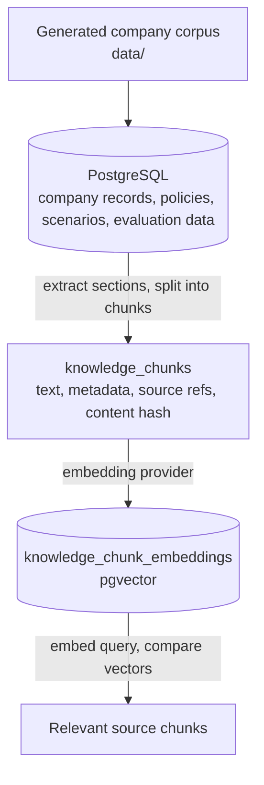
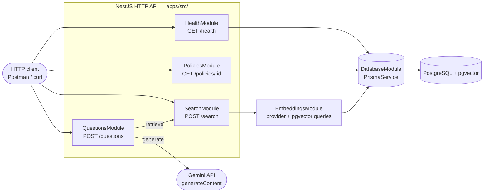

# SVGA Enterprise Intelligence

An agentic enterprise intelligence system being built to answer user questions using a company's own data: policies, organizational structure, business records, and operational context.

The goal is to combine **retrieval-augmented generation (RAG)**, **vector search**, and **large language models (LLMs)** so users can ask questions in everyday language and receive answers grounded in company evidence. An agent will select the appropriate tools, retrieve relevant documents or query structured records, and use an LLM to explain the findings with source references.

For example, “Who can approve this purchase?” may require both the procurement policy and the employee's role and approval limits. The intended system will combine document evidence with exact database lookups to produce a contextual answer.

## Current implementation and direction

The repository currently implements the **data and retrieval foundation** for that system. It uses a generated, synthetic SVGA company corpus for development and evaluation; live company-system integrations are future work.

| Capability | Status |
| --- | --- |
| Generate company records, policies, scenarios, and evaluation questions | Implemented |
| Validate and import source data into PostgreSQL using Prisma | Implemented |
| Split policy sections into traceable knowledge chunks | Implemented |
| Generate and store embeddings with provider/model metadata | Implemented |
| Search knowledge by meaning using pgvector | Implemented through terminal commands and services |
| Evaluate retrieval quality and benchmark search speed | Implemented |
| Generate policy-grounded answers with Gemini and source references | Implemented; generated citations are not independently verified |
| Agent orchestration, tool selection, and structured-data question answering | Planned |
| Question-answering, search, policy, and health HTTP APIs | Implemented; chat UI planned |
| Privately served open-source models | Planned integration option |

The NestJS application exposes policy lookup, semantic search, database health, and a first RAG question-answering endpoint. See the [HTTP API and Postman collection](docs/api/README.md). Ingestion workflows remain CLI commands.

## How the system works

### Data preparation — implemented



Embeddings represent text as lists of numbers so search can find related meaning even when a question uses different words from the policy. The current search compares vectors using cosine distance.

Company records such as employees, inventory, and approval limits remain relational data for precise queries. Policy prose becomes searchable knowledge. Evaluation answers are excluded from the retrieval corpus; synthetic scenario narratives require explicit selection and are excluded from embeddings.

### Question answering — initial RAG endpoint implemented

`POST /questions` retrieves policy chunks and sends the evidence to Gemini to compose an answer with numbered source references. `POST /search` returns evidence directly. Agent tool selection and structured operational queries remain planned.



`QuestionsModule` composes `SearchModule` for retrieval and calls Gemini directly for generation; it does not yet query structured tables (roles, approval limits, inventory) alongside policy evidence.

## Gemini and private model hosting

**The current default is Google's Gemini embedding model, `gemini-embedding-001`, configured for 1536-dimensional vectors.** It embeds policy chunks and search queries. Gemini also supplies answer generation through a separately configured `GEMINI_GENERATION_MODEL` and `GEMINI_API_KEY`.

An alternative OpenAI embedding adapter is also implemented. Provider selection is configured in `.env`, and search and storage use a shared embedding-provider interface.

The intended architecture also allows for **open-source LLMs served privately** on company-controlled infrastructure. A private deployment would need an answer-generation adapter and, if company text must remain entirely within that infrastructure, a privately hosted embedding model as well. These integrations are planned and are not currently available through an environment-variable switch.

With the current hosted embedding adapters, policy chunk text and search queries are sent to the configured provider. Switching embedding models requires rebuilding embeddings in the new model's space; changing vector dimensions also requires a database schema change.

See [provider configuration](docs/embeddings/provider.md) for implemented adapters and model settings.

## Technology

- **TypeScript and NestJS:** application structure and services.
- **PostgreSQL and Prisma:** relational storage, schema migrations, and data imports.
- **pgvector:** embedding storage and semantic similarity search.
- **Gemini API:** default embedding provider.
- **Docker Compose:** local PostgreSQL and application services.
- **Vitest:** unit and integration tests.

## Get started

Requirements: Node.js **24.15.0**, npm, Docker, and embedding-provider credentials for live embedding and search calls.

From the repository root:

```bash
nvm use
# Only if .env does not already exist:
cp .env.example .env
npm install
```

Edit `.env`: set `POSTGRES_PASSWORD` and the matching `DATABASE_URL`, then set `EMBEDDING_API_KEY` for your chosen provider. Do not commit credentials.

### Generate the corpus and prepare the database

```bash
npm run generate:data && \
npm run db:up -- --wait postgres && \
npm run db:generate && \
npm run db:migrate && \
npm run db:seed && \
npm run db:validate
```

`generate:data` writes the source files and runs consistency and data-model validation. `db:migrate` creates or updates tables; **`db:seed` loads the source files into those tables**. The command above starts only PostgreSQL so NestJS can run locally.

### Build searchable knowledge

```bash
npm run knowledge:setup
```

This builds and validates chunks, tests the embedding provider, builds embeddings, and verifies completeness. The provider test and embedding build make real API calls and may incur charges.

### Search and inspect

```bash
npm run search:semantic -- "Who can approve a purchase?"
npm run db:studio
```

Search returns relevant chunks and timing information. Studio opens a database browser and keeps running until you stop it.

### Run the server

In a separate terminal:

```bash
nvm use
npm run start:dev
```

This starts the HTTP API with automatic rebuilds and requires PostgreSQL. Search is available through both the CLI and `POST /search`. See [Postman setup](docs/api/README.md).

## Useful commands

| Command | Purpose |
| --- | --- |
| `npm run generate:data` | Generate all source data and validate it |
| `npm run validate:data` | Validate existing source data |
| `npm run db:setup` | Start Docker services, generate Prisma client, migrate, seed, validate, and open Studio |
| `npm run knowledge:setup` | Build and validate knowledge chunks and embeddings |
| `npm run embeddings:build -- --dry-run` | Preview pending embedding work without provider calls |
| `npm run evaluate:retrieval` | Measure retrieval quality against evaluation questions |
| `npm run search:benchmark` | Measure query embedding and database search latency |
| `npm run db:down` | Stop Docker services while preserving the database volume |
| `npm run db:reset` | Erase and recreate database tables, then reload source data |

`db:setup` starts both configured Docker services and ends in Studio, so it should not precede other commands in an unattended command chain. After a database reset, run `knowledge:setup` to rebuild derived knowledge and embeddings. Evaluation and benchmarking require complete embeddings and make real provider calls.

## Validation and tests

```bash
npm run build
npm test
npm run test:e2e
```

Unit tests use mocked providers. Database integration tests require a running, migrated PostgreSQL database; embedding integration tests use fake vectors rather than paid provider calls.

## Optional telemetry

Set both `OBSERVE_APP_KEY` and `OBSERVE_APP_SECRET` in `.env` to enable NestJS Observe. Without both credentials, telemetry stays disabled. Restart the server after changing `.env`.

## Documentation

- [Data model](docs/data-model/README.md)
- [Database and seeding](docs/database/README.md)
- [Knowledge ingestion and chunking](docs/knowledge/README.md)
- [Embeddings and semantic retrieval](docs/embeddings/README.md)
- [Retrieval evaluation](docs/embeddings/evaluation.md)

Some detailed documents describe earlier implementation phases. The status table above summarizes the current system boundary.
