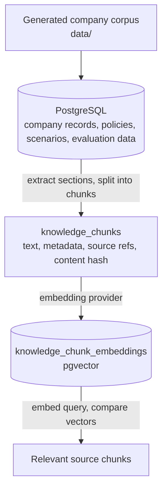
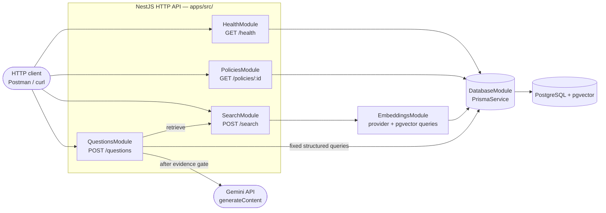

# SVGA Enterprise Intelligence

An enterprise knowledge system built to answer user questions using a company's own data: policies, organizational structure, business records, and operational context.

The goal is to combine **retrieval-augmented generation (RAG)**, **vector search**, and **large language models (LLMs)** so users can ask questions in everyday language and receive answers grounded in company evidence. The application selects a retrieval route, checks the evidence, and uses an LLM to explain supported findings with validated source references. Autonomous agents remain future work.

For example, “Who can approve this purchase?” may require both the procurement policy and the employee's role and approval limits. The implemented hybrid route combines policy evidence with bounded database lookups before permitting generation.

## Current implementation and direction

The repository implements the **data, retrieval, and three-gate question-answering pipeline** for that system. It uses a generated, synthetic SVGA company corpus for development and evaluation; live company-system integrations are future work.

| Capability | Status |
| --- | --- |
| Generate company records, policies, scenarios, and evaluation questions | Implemented |
| Validate and import source data into PostgreSQL using Prisma | Implemented |
| Split policy sections into traceable knowledge chunks | Implemented |
| Generate and store embeddings with provider/model metadata | Implemented |
| Search knowledge by meaning using pgvector | Implemented through terminal commands and services |
| Evaluate retrieval quality and benchmark search speed | Implemented |
| Generate evidence-grounded answers with Gemini and validated citations | Implemented with three application guardrail gates |
| Structured-data question answering | Implemented with bounded Prisma templates |
| Autonomous agent orchestration and tool selection | Planned; outside Phase 7 |
| Question-answering, search, policy, and health HTTP APIs | Implemented; chat UI planned |
| Privately served open-source models | Planned integration option |

The NestJS application exposes policy lookup, semantic search, database health, and a first RAG question-answering endpoint. See the [HTTP API and Postman collection](docs/api/README.md). Ingestion workflows remain CLI commands.

## How the system works

### Data preparation — implemented


```mermaid
flowchart TD
    corpus["Generated company corpus<br/>data/"] --> db[("PostgreSQL<br/>company records, policies, scenarios, evaluation data")]
    db -->|"extract sections, split into chunks"| chunks["knowledge_chunks<br/>text, metadata, source refs, content hash"]
    chunks -->|"embedding provider"| vectors[("knowledge_chunk_embeddings<br/>pgvector")]
    vectors -->|"embed query, compare vectors"| results["Relevant source chunks"]
```

Embeddings represent text as lists of numbers so search can find related meaning even when a question uses different words from the policy. The current search compares vectors using cosine distance.

Company records such as employees, inventory, and approval limits remain relational data for precise queries. Policy prose becomes searchable knowledge. Evaluation answers are excluded from the retrieval corpus; synthetic scenario narratives require explicit selection and are excluded from embeddings.

### Question answering — Phase 7 guardrails implemented

`POST /questions` checks input scope/security, routes fixed structured queries and semantic policy retrieval, establishes evidence sufficiency, then calls Gemini and validates its citations and numeric grounding. Failed gates return explicit rejection or abstention outcomes. `POST /search` returns evidence directly. See [Phase 7 guardrails, calibration, and limitations](docs/guardrails.md).


```mermaid
flowchart LR
    client(["HTTP client<br/>Postman / curl"])

    subgraph api["NestJS HTTP API — apps/src/"]
        health["HealthModule<br/>GET /health"]
        policies["PoliciesModule<br/>GET /policies/:id"]
        search["SearchModule<br/>POST /search"]
        questions["QuestionsModule<br/>POST /questions"]
    end

    embeddings["EmbeddingsModule<br/>provider + pgvector queries"]
    database[("DatabaseModule<br/>PrismaService")]
    postgres[("PostgreSQL + pgvector")]
    gemini(["Gemini API<br/>generateContent"])

    client --> health
    client --> policies
    client --> search
    client --> questions
    health --> database
    policies --> database
    search --> embeddings
    questions -->|retrieve| search
    questions -->|fixed structured queries| database
    questions -->|after evidence gate| gemini
    embeddings --> database
    database --> postgres
```

`QuestionsModule` combines `SearchModule` with bounded structured queries and separate input, evidence, and output gates. Generation runs only after sufficient evidence is established. The detailed pipeline and measured evaluation results are in the [guardrail report](docs/guardrails.md).

## Phase 7 verification and limitations

```text
User → Input gate → Router → Structured / Semantic / Hybrid retrieval
     → Evidence gate → Reranking → Context builder → Gemini
     → Output grounding gate → Answer + validated citations
```

The input gate validates requests and checks scope, prompt injection, and secret requests. The evidence gate checks source authority, relevance, coverage, and basic conflicts. The output gate validates application-assigned citations and basic numeric grounding; invalid citations allow one retry. Requests rejected before generation never call Gemini.

The recorded calibration uses all **173 evaluation questions** with `gemini-embedding-001` (1536 dimensions, cosine similarity), selecting an initial threshold of **0.5940823**. The complete pipeline permits **60 of 163 answerable questions** and **0 of 10 unanswerable questions**. The remaining **103 false abstentions are a substantial limitation**, reflecting conservative coverage checks, bounded query templates, and excluded synthetic scenario context. These are calibration-set measurements, not held-out accuracy.

Verification recorded on **2026-09-18**: **120 unit tests and 44 integration tests passed**, along with the build and TypeScript checks. Mock-provider tests prove zero generation calls for out-of-scope, injection, unsafe, empty-evidence, insufficient-evidence, and conflicting-evidence requests. Live retrieval smoke checks passed the evidence gate for policy, structured, hybrid, and policy-based cross-domain examples, but **live Gemini synthesis was not verified** because generation credentials and the model were unset during that run.

Citation and numeric checks are a first grounding implementation, not a complete hallucination detector. Review the [full guardrail report](docs/guardrails.md), [per-question evaluation](docs/guardrail-evaluation.json), and [live dependency smoke results](docs/guardrail-live-smoke.json) for measured behavior and limitations.

- `npm run evaluate:guardrails` reruns retrieval and calibration against the current database without generation; it updates the evaluation report and model-bound default threshold.
- `npm run guardrails:smoke` checks eight representative requests against live dependencies and may call Gemini when configured and permitted by the gates.
- Set `GEMINI_API_KEY` and `GEMINI_GENERATION_MODEL` locally to enable generation. See `.env.example` for guardrail configuration; keep credentials out of Git.

## Gemini and private model hosting

**The current default is Google's Gemini embedding model, `gemini-embedding-001`, configured for 1536-dimensional vectors.** It embeds policy chunks and search queries. Gemini also supplies answer generation through a separately configured `GEMINI_GENERATION_MODEL` and `GEMINI_API_KEY`.

An alternative OpenAI embedding adapter is also implemented. Provider selection is configured in `.env`, and search and storage use a shared embedding-provider interface.

The intended architecture also allows for **open-source LLMs served privately** on company-controlled infrastructure. A private deployment would need an answer-generation adapter and, if company text must remain entirely within that infrastructure, a privately hosted embedding model as well. These integrations are planned and are not currently available through an environment-variable switch.

With the current hosted embedding adapters, policy chunk text and search queries are sent to the configured provider. Switching embedding models requires rebuilding embeddings in the new model's space; changing vector dimensions also requires a database schema change.

See [provider configuration](docs/embeddings/provider.md) for implemented adapters and model settings.

## Technology

- **TypeScript and NestJS:** application structure and services.
- **PostgreSQL and Prisma:** relational storage, schema migrations, and data imports.
- **pgvector:** embedding storage and semantic similarity search.
- **Gemini API:** default embedding provider.
- **Docker Compose:** local PostgreSQL and application services.
- **Vitest:** unit and integration tests.

## Get started

Requirements: Node.js **24.15.0**, npm, Docker, and embedding-provider credentials for live embedding and search calls.

From the repository root:

```bash
nvm use
# Only if .env does not already exist:
cp .env.example .env
npm install
```

Edit `.env`: set `POSTGRES_PASSWORD` and the matching `DATABASE_URL`, then set `EMBEDDING_API_KEY` for your chosen provider. Do not commit credentials.

### Generate the corpus and prepare the database

```bash
npm run generate:data && \
npm run db:up -- --wait postgres && \
npm run db:generate && \
npm run db:migrate && \
npm run db:seed && \
npm run db:validate
```

`generate:data` writes the source files and runs consistency and data-model validation. `db:migrate` creates or updates tables; **`db:seed` loads the source files into those tables**. The command above starts only PostgreSQL so NestJS can run locally.

### Build searchable knowledge

```bash
npm run knowledge:setup
```

This builds and validates chunks, tests the embedding provider, builds embeddings, and verifies completeness. The provider test and embedding build make real API calls and may incur charges.

### Search and inspect

```bash
npm run search:semantic -- "Who can approve a purchase?"
npm run db:studio
```

Search returns relevant chunks and timing information. Studio opens a database browser and keeps running until you stop it.

### Run the server

In a separate terminal:

```bash
nvm use
npm run start:dev
```

This starts the HTTP API with automatic rebuilds and requires PostgreSQL. Search is available through both the CLI and `POST /search`. See [Postman setup](docs/api/README.md).

## Useful commands

| Command | Purpose |
| --- | --- |
| `npm run generate:data` | Generate all source data and validate it |
| `npm run validate:data` | Validate existing source data |
| `npm run db:setup` | Start Docker services, generate Prisma client, migrate, seed, validate, and open Studio |
| `npm run knowledge:setup` | Build and validate knowledge chunks and embeddings |
| `npm run embeddings:build -- --dry-run` | Preview pending embedding work without provider calls |
| `npm run evaluate:retrieval` | Measure retrieval quality against evaluation questions |
| `npm run evaluate:guardrails` | Calibrate and evaluate all 173 questions without generation |
| `npm run guardrails:smoke` | Check eight representative requests against live dependencies |
| `npm run search:benchmark` | Measure query embedding and database search latency |
| `npm run db:down` | Stop Docker services while preserving the database volume |
| `npm run db:reset` | Erase and recreate database tables, then reload source data |

`db:setup` starts both configured Docker services and ends in Studio, so it should not precede other commands in an unattended command chain. After a database reset, run `knowledge:setup` to rebuild derived knowledge and embeddings. Evaluation and benchmarking require complete embeddings and make real provider calls.

## Validation and tests

```bash
npm run build
npm test
npm run test:e2e
```

Unit tests use mocked providers. Database integration tests require a running, migrated PostgreSQL database; embedding integration tests use fake vectors rather than paid provider calls.

## Optional telemetry

Set both `OBSERVE_APP_KEY` and `OBSERVE_APP_SECRET` in `.env` to enable NestJS Observe. Without both credentials, telemetry stays disabled. Restart the server after changing `.env`.

## Documentation

- [Data model](docs/data-model/README.md)
- [Database and seeding](docs/database/README.md)
- [Knowledge ingestion and chunking](docs/knowledge/README.md)
- [Embeddings and semantic retrieval](docs/embeddings/README.md)
- [Retrieval evaluation](docs/embeddings/evaluation.md)

Some detailed documents describe earlier implementation phases. The status table above summarizes the current system boundary.
