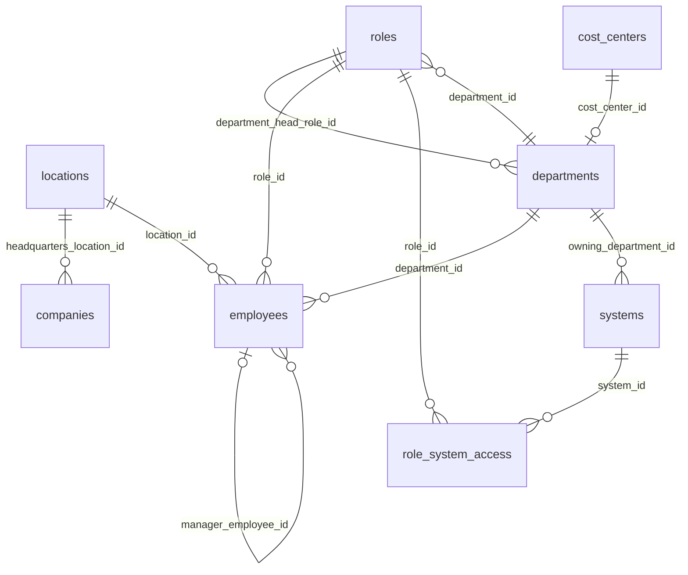
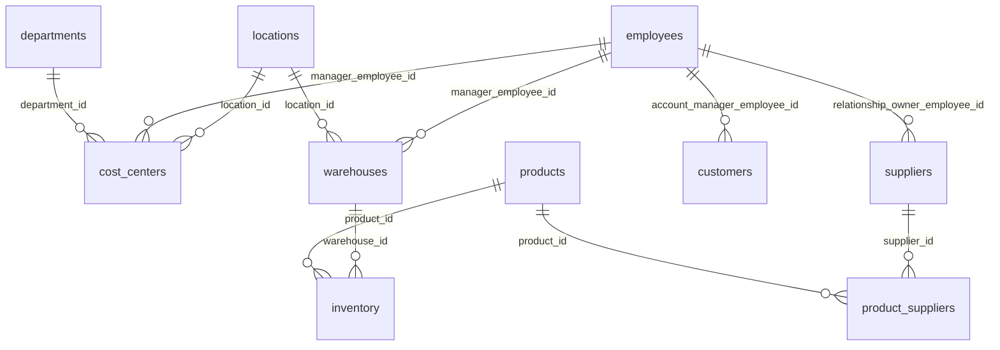
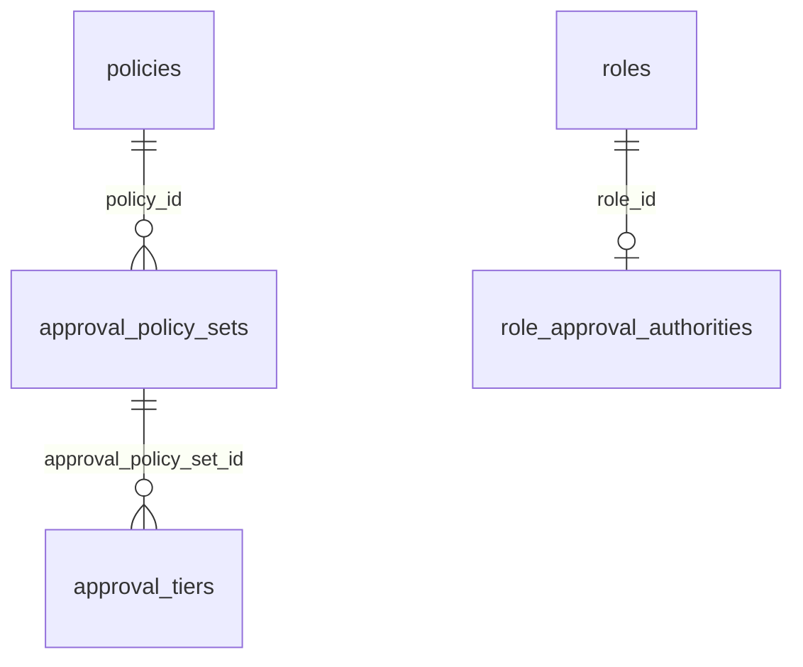
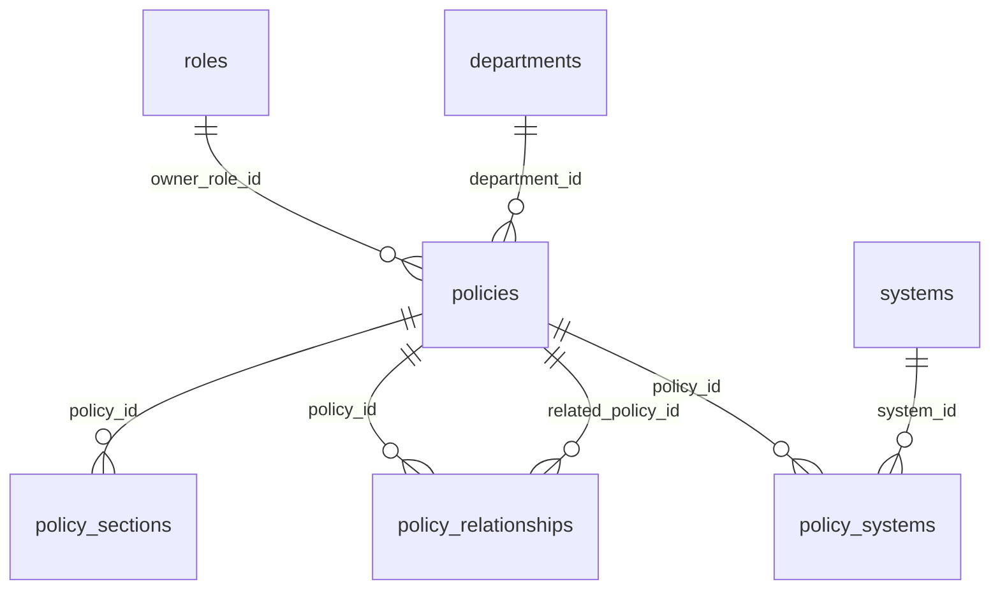
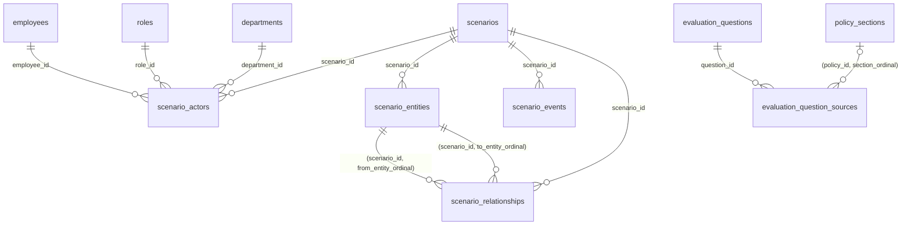

# ER diagrams

Mermaid source is used as reviewable Markdown and renders in Mermaid-capable viewers. Diagrams are split by domain; the relationship catalog is authoritative for all typed-target alternatives. Crow’s foot is child multiplicity; `o` marks optional participation.

## Core enterprise

## Master data

## Business rules

## Knowledge

## Scenarios and evaluation

scenario_entities and evaluation_question_sources each have exactly one typed enterprise/policy target (evaluation also allows scenario). All alternatives and nullability are enumerated in relationships.md; hiding those repeated edges here keeps the diagram readable. Scenario systems/policies membership is represented through scenario_entities; question metadata references use evaluation_question_sources.reference_kind.
